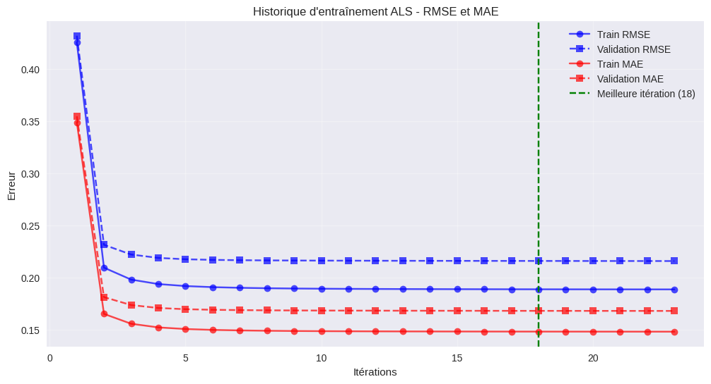
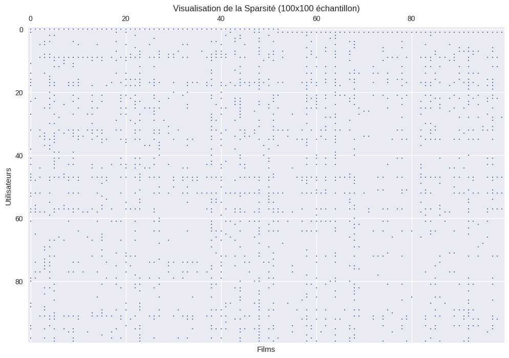
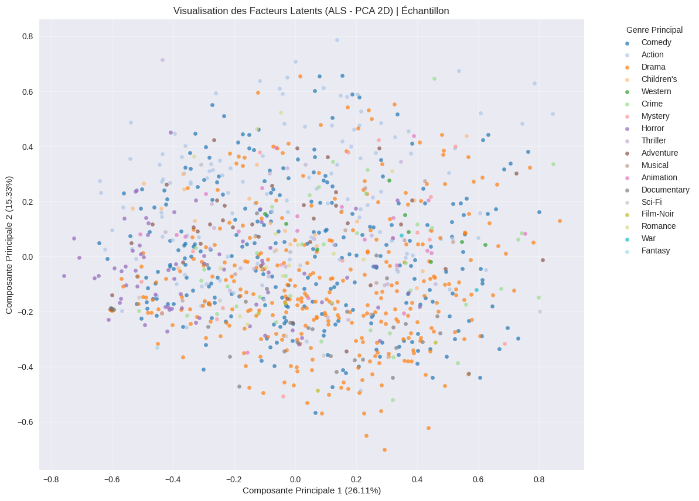

# ALS vs SVD - Systèmes de Recommandation MovieLens

Comparaison de deux algorithmes de recommandation collaborative : **ALS** et **SVD** sur le dataset MovieLens 1M.

## À Propos

- **ALS** : Implémentation from scratch avec early stopping et régularisation
- **SVD** : Implémentation Surprise pour comparaison
- **Dataset** : MovieLens 1M (6,040 utilisateurs × 3,706 films)

## Auteurs

- Mohamed LKHALIDI
- Ahmed BOUBA

**Master Intelligent Systems** - Université Moulay Ismail, Novembre 2025

---

## Dataset

### Caractéristiques

```
Utilisateurs : 6,040
Films : 3,706
Évaluations : 1,000,209
Sparsité : 95.64%
Densité : 4.36%
```

### Structure

- `ratings.dat` : UserID, MovieID, Rating (1-5)
- `movies.dat` : Titres et genres
- `users.dat` : Infos utilisateurs

---

## Résultats

### Performance Comparative

| Modèle  | RMSE   | MAE    |
| ------- | ------ | ------ |
| **ALS** | 0.2160 | 0.1683 |
| **SVD** | 0.2417 | 0.1965 |

**Conclusion** : ALS légèrement meilleur

---

## Méthodologie

### Prétraitement

- Normalisation : notes 1-5 → 0-1
- Matrices creuses CSR (efficacité mémoire)
- Split : 75% train / 25% test

### Implémentation ALS

```python
class ALSRecommender:
    - Optimisation itérative (résolution systèmes linéaires)
    - Early stopping après 5 itérations sans amélioration
    - Régularisation L2 (λ = 1.1)
    - Métriques : RMSE, MAE, NDCG
```

### Algorithme SVD

- Factorisation de matrices
- 10 facteurs latents
- Learning rate : 0.005
- 30 epochs

---

## Visualisations

### Courbes d'Entraînement



### Matrice Creuse



### Facteurs Latents (PCA)



---

## Installation & Utilisation

### Installation Rapide

```bash
git clone https://github.com/BoubaAhmed/ALS-Alternating-Least-Squares-Recommender.git
cd ALS-Alternating-Least-Squares-Recommender

python -m venv venv
venv\Scripts\activate  # Windows

pip install -r requirements.txt
jupyter notebook als-vs-svd-movies1m.ipynb
```

### Exemple Usage

```python
# Créer et entraîner le modèle
model = ALSRecommender(n_factors=10, lambda_reg=1.1)
model.fit(train_matrix, validation_matrix=val_matrix)

# Obtenir 10 recommandations
recs = model.recommend_for_user(user_id=100, n_recommendations=10)

# Évaluer
rmse = model.calculate_rmse(test_matrix)
mae = model.calculate_mae(test_matrix)
```

---

## Contenu du Notebook

1. Installation dépendances
2. Téléchargement MovieLens 1M
3. Exploration et analyse données
4. Prétraitement & normalisation
5. Construction matrices CSR
6. Split train/test/validation
7. **Implémentation complète ALS**
8. Entraînement avec early stopping
9. **SVD via Surprise**
10. Comparaison ALS vs SVD
11. Visualisation PCA facteurs latents
12. Métriques d'évaluation avancées
13. Exemples recommandations personnalisées
14. Graphiques comparatifs

---

## Métriques Utilisées

- **RMSE** : Erreur quadratique moyenne (0-1 normalisé)
- **MAE** : Erreur absolue moyenne
- **Precision@k** : Proportion recommandations pertinentes
- **Recall@k** : Capacité retrouver items pertinents
- **NDCG@k** : Qualité du ranking (pénalité de position)
- **Coverage@k** : Diversité catalogue utilisé

---

## Fichiers

```
├── als-vs-svd-movies1m.ipynb    # Notebook principal
├── rapport_ALS.pdf               # Rapport détaillé
├── README.md                      # Ce fichier
├── requirements.txt               # Dépendances
├── SETUP.md                       # Installation détaillée
├── QUICKSTART.md                  # Démarrage rapide
└── PPT/
    ├── PPT_ALS_*.pdf              # Présentations
    └── *.png                       # Visualisations
```

---

## Dépendances

```
numpy, pandas, scipy, scikit-learn
matplotlib, scikit-surprise, implicit
kagglehub, jupyter
```

Voir `requirements.txt` pour les versions exactes.

---

## Licence

MIT License - Voir `LICENSE` pour détails

---

**Dernière mise à jour** : Novembre 2025